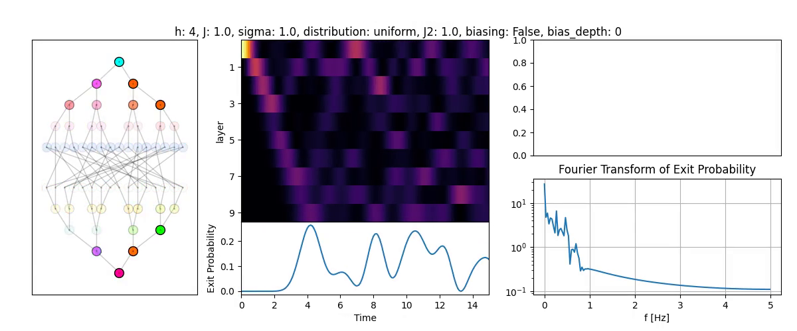

# Glued-Trees Quantum Walks

Python simulation toolkit for studying continuous-time quantum walks on disordered glued-trees graphs and testing whether intra-layer connectivity can protect transport from localization.

The long-term research question is whether bounded-degree, size-independent, long-range couplings within each layer can change the infinite-time-averaged exit probability from exponential decay with tree depth to power-law decay:

$$
\left\langle \overline{P}_{\mathrm{exit}}^{(\infty)}(L) \right\rangle
\sim e^{-L/\xi}
\quad\longrightarrow\quad
\left\langle \overline{P}_{\mathrm{exit}}^{(\infty)}(L) \right\rangle
\sim L^{-\alpha}.
$$

> **Project status:** the repository currently provides an exploratory numerical baseline. It implements glued-trees construction, static disorder, dense and probabilistic intra-layer controls, time evolution, and visualization. It does not yet establish the bounded-degree asymptotic claim described in [SPEC.md](SPEC.md).

<p align="center">
  
</p>

---

## Overview

A glued-trees graph consists of two balanced binary trees whose leaves are joined by two random matchings. A walker starts at the entrance root of the first tree and must traverse the randomly glued region to reach the exit root of the second tree.

The implemented simulations use a weighted graph-Laplacian Hamiltonian with static on-site disorder,

$$
H = L_w(G) + \sum_i \omega_i |i\rangle\langle i|,
$$

where the backbone edges have coupling $J$, optional intra-layer edges have coupling $J_2$, and $\omega_i$ is sampled once per disorder realization. The state evolves according to

$$
i\frac{d}{dt}|\psi(t)\rangle = H|\psi(t)\rangle,
$$

starting by default from a single excitation at the entrance root.

The main observable is the probability at the exit layer. The toolkit also resolves the full layer distribution over time and computes the Fourier spectrum of the exit-probability signal.

---

## Key Features

- **Canonical glued-trees graphs**: two depth-$h$ binary trees connected by two independently shuffled leaf matchings.

- **Static on-site disorder**: uniform, Gaussian, and Lorentzian disorder models with reproducible NumPy random-number generators.

- **Intra-layer connectivity controls**:
  - dense all-to-all couplings within each layer;
  - optional nearest-neighbor chains within layers;
  - probabilistically sampled long-range intra-layer edges.

- **Continuous-time quantum dynamics**: state propagation with QuTiP's Schrödinger-equation solver.

- **Transport diagnostics**: time-resolved layer populations, exit probability, infinite-time layer averages for finite systems, and Fourier analysis of the exit signal.

- **Visualization**: graph-state snapshots, layer-population heatmaps, exit-probability curves, spectral plots, and rendered movies.

- **Research program and literature map**: the target model, evidence standards, and supporting theory are documented in [SPEC.md](SPEC.md) and the [project wiki](wiki/index.md).

---

## Physics Background

### Glued-Trees Geometry

For tree depth $h$, each binary tree contains $2^{h+1}-1$ vertices. The full graph therefore contains

$$
N = 2\left(2^{h+1}-1\right)
$$

vertices arranged into $2(h+1)$ layers. Every leaf has one parent edge and two cross-tree gluing edges. The random middle region hides the path from entrance to exit from algorithms that only explore the graph locally.

### Disorder and Localization

Static diagonal disorder breaks the symmetry that supports coherent propagation through the layer-symmetric subspace. In the current implementation, the on-site energies can be drawn from

$$
\omega_i \sim U[-\sqrt{3}\sigma,\sqrt{3}\sigma],
\qquad
\omega_i \sim \mathcal{N}(0,\sigma^2),
$$

or a standard Cauchy distribution. In the current Cauchy branch, `sigma` is not applied. The central numerical question is how disorder suppresses exit transport as the graph grows.

### Intra-Layer Protection

Extra edges between vertices in the same layer can mix disorder-dark states back into the layer-symmetric transport channel. The present all-to-all and independent-edge constructions are exploratory controls. The research target in [SPEC.md](SPEC.md) is stricter: added degree and $J_2/J$ must remain bounded independently of $h$ and $N$.

---

## Repository Structure

```text
glued-trees/
├── src/
│   ├── glued_trees/
│   │   ├── classes.py          # Graphs, disorder, Hamiltonians, and dynamics
│   │   ├── analyze.py          # Layer populations and exit-signal analysis
│   │   └── visualize.py        # Static plots and movie rendering
│   ├── utils/                  # Shared numerical, plotting, file, and video helpers
│   └── code_paths.py           # Repository output paths
├── scripts/
│   ├── layer_distribution_plot.py  # Layer-population comparison across disorder
│   └── study.py                    # Exploratory simulations and parameter sweeps
├── wiki/                       # Concepts, literature map, and project status
├── raw/                        # Imported literature and project snapshots
├── outputs/                    # Generated figures, movies, and data (gitignored)
├── SPEC.md                     # Governing research specification
└── requirements.txt            # Pinned Python dependencies
```

---

## Installation

### Prerequisites

- Python 3.13 (the pinned dependency set targets this version)
- A virtual environment
- Optional for graph rendering: Graphviz and PyGraphviz

### Setup

```bash
git clone https://github.com/AdQuanta/glued-trees.git
cd glued-trees

python3.13 -m venv .venv
source .venv/bin/activate

python -m pip install --upgrade pip
python -m pip install -r requirements.txt
```

The numerical simulation does not require Graphviz. Plotting the graph itself uses NetworkX's `graphviz_layout`, so install Graphviz and PyGraphviz separately if that layout backend is not already available on your system.

### Core Dependencies

| Package | Version | Purpose |
|---|---:|---|
| [QuTiP](https://qutip.org/) | 5.2.0 | Quantum-state representation and time evolution |
| [NumPy](https://numpy.org/) | 2.3.0 | Numerical arrays and random sampling |
| [SciPy](https://scipy.org/) | 1.16.3 | Sparse matrices and numerical routines |
| [NetworkX](https://networkx.org/) | 3.5 | Graph construction and weighted Laplacians |
| [Matplotlib](https://matplotlib.org/) | 3.10.3 | Scientific visualization |
| [MoviePy](https://zulko.github.io/moviepy/) | 2.2.1 | Animation export |

---

## Quick Start

Run a reproducible disordered walk and inspect its exit probability:

```python
from src.glued_trees import GluedTreesDisorder
from src.glued_trees.analyze import full_analysis

graph = GluedTreesDisorder(
    h=4,
    J=1.0,
    sigma=0.5,
    distribution="gaussian",
    rng=0,
)

result = full_analysis(graph, max_t=20.0, dt=0.1, prog_bar=False)

print(f"vertices: {graph.N}")
print(f"maximum exit probability: {result.exit_probabilities.max():.6f}")
```

To add probabilistic intra-layer couplings:

```python
from src.glued_trees import GluedTreesSmallWorld

graph = GluedTreesSmallWorld(
    h=4,
    J=1.0,
    J2=1.0,
    p=0.1,
    nn=True,
    sigma=0.5,
    distribution="gaussian",
    rng=0,
)
```

Here `p` is the independent inclusion probability for each possible intra-layer edge; it is not a bounded-degree parameter.

---

## Key Scripts

- **[scripts/layer_distribution_plot.py](scripts/layer_distribution_plot.py)** — compares time-resolved layer populations for several disorder strengths and saves the resulting figure under `outputs/`.

- **[scripts/study.py](scripts/study.py)** — exploratory entry points for snapshots, movies, and parameter sweeps of exit-signal frequency and mean exit probability.

Run scripts from the repository root with the virtual environment active:

```bash
python scripts/layer_distribution_plot.py
```

Generated research artifacts are written to `outputs/` and are intentionally not tracked by Git.

---

## Model Parameters

| Symbol / name | Meaning |
|---|---|
| $h$ | Depth of each binary tree |
| $N$ | Total number of vertices, $2(2^{h+1}-1)$ |
| $J$ | Glued-trees backbone coupling |
| $J_2$ | Intra-layer coupling |
| $p$ | Probability of including each candidate long-range intra-layer edge |
| `nn` | Whether to add a nearest-neighbor chain within each nontrivial layer |
| $\sigma$ | Disorder scale |
| $P_{\mathrm{exit}}(t)$ | Probability on the exit vertex at time $t$ |

---

## Current Scope

The codebase is suitable for small-system exploratory simulations and visualization. The following items belong to the active research program and should not be inferred from the current implementation:

- bounded-degree protection families with size-independent resources;
- both adjacency- and Laplacian-Hamiltonian formulations;
- converged disorder, network, and gluing ensembles;
- rigorous infinite-time averages and asymptotic model comparison;
- mechanism diagnostics and frozen scientific verifiers.

See the [current implementation baseline](wiki/project/current-implementation-baseline.md) for a source-level inventory and [SPEC.md](SPEC.md) for the full paper-readiness criteria.

---

## Verification

The repository does not yet have a tracked automated test suite. Run the deterministic syntax check before committing changes:

```bash
python -m compileall src scripts
```

For numerical changes, add and run a focused deterministic smoke check with a fixed random seed.

## Contact

For questions, bug reports, or collaboration inquiries, open an issue in the [GitHub repository](https://github.com/AdQuanta/glued-trees/issues).

## Acknowledgments

This project uses [QuTiP](https://qutip.org/) for quantum dynamics, [NetworkX](https://networkx.org/) for graph construction, and the NumPy/SciPy/Matplotlib scientific Python ecosystem for analysis and visualization.
